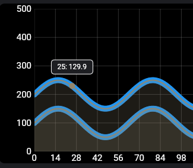

Flutter package for drawing charts

## Setup

To use this package, add `flutter_chart` as a dependency in your pubspec.yaml file.

## How to use

Look at the [example](./example/lib/main.dart) project for a working example.

## Issues

Please file any issues, bugs or feature request as an issue on our [GitHub](https://github.com/Iconica-Development/flutter_chart/issues) page. Commercial support is available if you need help with integration with your app or services. You can contact us at [support@iconica.nl](mailto:support@iconica.nl).

## Want to contribute

If you would like to contribute to the plugin (e.g. by improving the documentation, solving a bug or adding a cool new feature), please carefully review our [contribution guide](../CONTRIBUTING.md) and send us your [pull request](https://github.com/Iconica-Development/flutter_chart/pulls).

## Author

This `flutter_chart` for Flutter is developed by [Iconica](https://iconica.nl). You can contact us at <support@iconica.nl>
